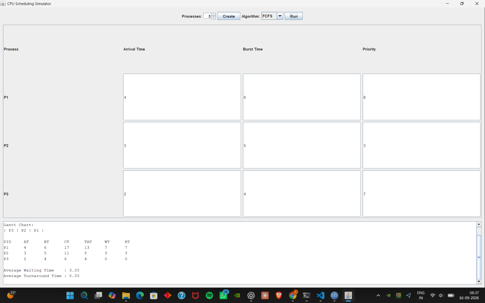
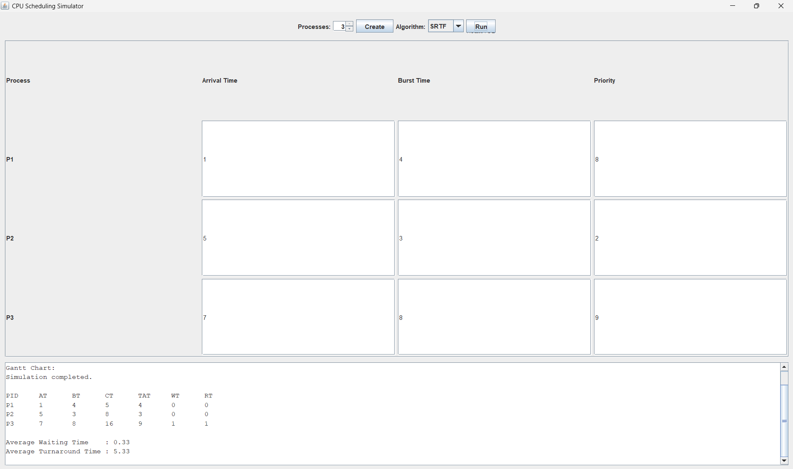
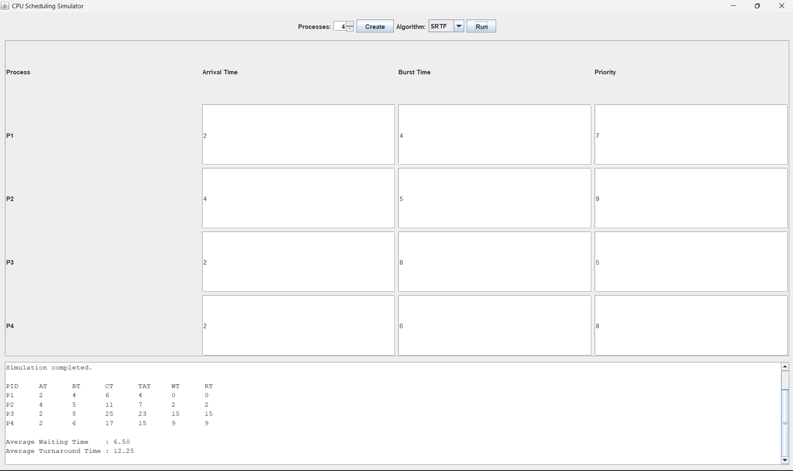

# CPU Process Scheduling Simulator

## Project Description

CPU Process Scheduling Simulator is a Java-based project developed to
understand and demonstrate the working of CPU scheduling algorithms.

In an operating system, multiple processes may be waiting for the CPU at the
same time. The CPU scheduler decides which process should be executed and in
what order.

This project allows the user to enter process details such as Arrival Time,
Burst Time and Priority. The user can then select a scheduling algorithm and
run the simulation. The program calculates the required scheduling parameters
and displays the results in a simple graphical interface.

The project is mainly designed as a learning tool for understanding how
different CPU scheduling algorithms affect process execution and waiting time.

## Algorithms Used

The simulator currently supports four CPU scheduling algorithms:

### 1. First Come First Serve (FCFS)

FCFS executes processes according to their arrival order. The process that
arrives first gets the CPU first and continues until it finishes.

### 2. Shortest Job First (SJF)

SJF selects the process with the smallest Burst Time from the processes that
have already arrived. It is a non-preemptive scheduling algorithm.

### 3. Shortest Remaining Time First (SRTF)

SRTF is the preemptive version of SJF. It checks the remaining execution time
of available processes and selects the process with the shortest remaining
time.

### 4. Priority Scheduling

Priority Scheduling selects a process based on its priority. In this project,
a smaller priority number represents a higher priority.

## Features

- Supports 1 to 10 processes
- Simple graphical user interface using Java Swing
- Takes Arrival Time, Burst Time and Priority as input
- Allows the user to select a scheduling algorithm
- Supports FCFS, SJF, SRTF and Priority Scheduling
- Calculates Completion Time (CT)
- Calculates Turnaround Time (TAT)
- Calculates Waiting Time (WT)
- Calculates Response Time (RT)
- Displays Average Waiting Time
- Displays Average Turnaround Time
- Checks for invalid input values
- Includes a console version as well as a GUI version

## Technologies Used

- Java
- Java Swing
- Object-Oriented Programming
- VS Code / Java Development Kit (JDK)

## Project Structure

```text
CPU Scheduling Simulator
│
├── Process.java
├── FCFS.java
├── SJF.java
├── SRTF.java
├── Priority.java
├── Main.java
├── SimulatorGUI.java
└── README.md

## Testing

The simulator was tested using different process inputs to check whether the
scheduling algorithms produce the expected results.

The following cases were tested:

- FCFS with different Arrival Times
- SJF with different Burst Times
- SRTF with processes arriving at different times
- Priority Scheduling with different priority values
- Different numbers of processes from 1 to 10
- Invalid and empty input values

For each test, the calculated Completion Time, Turnaround Time, Waiting Time
and Response Time were checked.

## Screenshots






## How to Run
1. Open the project folder in Command Prompt or VS Code Terminal.

2. Compile the Java files:

```bash
javac *.java
java SimulatorGUI